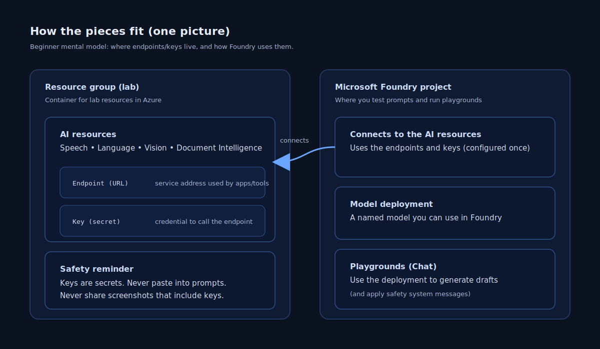

# Student guide — SK Finance Azure AI training (slides companion)

## Concept overview
This guide is the “why + how it fits together” companion to the slide deck.

In this training, you practice three repeatable patterns that show up in lending operations:
- **Pattern A (KYC extraction):** document image → extract fields → decide “manual review required?”
- **Pattern B (call analytics):** call audio → transcribe → redact PII → summarize + route
- **Pattern C (customer comms):** redacted context → generate safe SMS/email drafts with placeholders

### How the pieces fit (one picture)

### Where Microsoft Foundry fits
**Microsoft Foundry (ai.azure.com)** is the web portal used in this training to:
- Work in a facilitator-provided project.
- Use playgrounds (for example, **Chat playground**) to test prompts safely.
- Use “AI services” capabilities (Speech, Language, Vision, Document Intelligence) during the labs.

Key terms used across the labs:
- **Resource group:** a folder in Azure for lab resources.
- **Resource:** one AI service (Speech, Language, Vision, Document Intelligence).
- **Endpoint:** the service URL.
- **Key:** the secret used to call the service (treat it like a password).
- **Model deployment:** a named model you can use in Foundry.

## Why it matters for SK Finance
These patterns map cleanly to real NBFC workflows:
- **KYC**: extract key fields from identity documents and route low-confidence cases for manual review.
- **Grievances**: turn a call recording into a redacted, human-ready summary and a single routing label.
- **Comms**: draft compliant, consistent SMS/email templates without leaking PII.

The goal is not “perfect AI.” The goal is a workflow that:
- Is **auditable** (what happened, when, and why).
- Is **safe** (redact PII early, use placeholders, apply approvals).
- Is **operationally usable** (consistent format, single routing label, clear next action).

## Illustrated example (synthetic)
This section uses a single synthetic scenario to connect all three patterns.

### Scenario
A synthetic SK Finance customer calls about a delayed loan disbursal. The call contains personal details. Separately, the customer has submitted a KYC ID image.

### Pattern A: KYC extraction → manual review decision
- Input: a **synthetic ID image**.
- Output: extracted fields + confidence.
- Decision rule used in training: **confidence < 0.85 → manual review required**.

Where you do it: follow the lab steps in:
- [Lab 1 — KYC document verification](../../labs/01-kyc-document-verification/README.md)

What “good output” looks like:
- A small table of extracted fields where each row includes:
  - field value
  - confidence
  - manual review required (Yes/No)
  - a short note if review is required

### Pattern B: call analytics → transcribe → redact → summarize → route
- Input: a **synthetic WAV** call recording.
- Step 1: **Speech to text** produces a transcript.
- Step 2: **PII redaction** identifies and masks personal data.
- Step 3: the redacted transcript is summarized and assigned **exactly one routing label**.

Where you do it: follow the lab steps in:
- [Lab 2 — Call analysis and grievance automation](../../labs/02-call-analysis-and-grievance-automation/README.md)

What “good output” looks like:
- A transcript (for the lab).
- A **redacted transcript** (this is the version you should use for any downstream summarization/comms drafting).
- A short, consistent summary using the headings:
  - Customer issue:
  - Impact:
  - What the agent did:
  - Next action required:

### Pattern C: customer comms drafting → placeholders + JSON
- Input: redacted context (summary + routing label).
- Output: one SMS template + one email template, both using placeholders.

Where you do it: follow the lab steps in:
- [Lab 3 — Comms templates (SMS + email)](../../labs/03-comms-templates-sms-email/README.md)

What “good output” looks like:
- SMS stays short and uses placeholders like `<CUSTOMER_NAME>` and `<REFERENCE_ID>`.
- Email includes a clear subject and body.
- Output is structured as JSON so it can be validated and logged.

## Key decisions & trade-offs
### Confidence thresholds (quality vs speed)
- Higher thresholds reduce automation risk but increase manual review volume.
- Lower thresholds increase automation but can increase errors.

In this training, the threshold is fixed to make outputs comparable across the class.

### Redact before you generate (privacy vs convenience)
- Redaction reduces the chance of leaking PII into prompts, logs, or drafted messages.
- Redaction is not automatic compliance; you still verify the output and apply approvals.

### Exactly one routing label (operational clarity)
- One label makes downstream work predictable and reportable.
- Multiple labels can cause two teams to act at once.

### Placeholders in customer comms (safety vs personalization)
- Placeholders prevent accidental exposure of PII.
- A human (or a controlled system) fills placeholders from approved sources later.

### System message + safety system messages (control vs flexibility)
When you use the Foundry Chat playground in this training (Foundry classic), the workflow is:
1. Enter your instructions in the **System message** box.
2. To add safety messages, select **Add section** → **Safety system messages**.
3. Select **Apply changes**, then select **Continue** when prompted.

This helps keep output rules consistent across runs.

## Compliance / safety notes (RBI-aligned)
- Use **synthetic** data only (no real PAN/Aadhaar/customer calls).
- Treat extracted fields, transcripts, and drafts as **sensitive**.
- Do not paste **keys** into prompts or documents; do not include secrets in screenshots.
- Use **least privilege** access only (you should not need Owner).
- Store the **minimum** data needed and keep it only as long as required.

## Summary checklist
Use this checklist when reviewing your lab outputs:
- **Data safety**: you used synthetic data only; you did not paste keys into prompts.
- **KYC decision**: you recorded values + confidence + a clear “manual review required” decision.
- **Privacy gate**: you created and used a redacted transcript for downstream steps.
- **Operations-ready outputs**: summary is consistent and includes “next action required.”
- **Routing**: exactly one routing label is selected.
- **Comms**: SMS/email are placeholders-only and structured (JSON).
- **Approvals**: you can point to where a human approval would happen in production.

## References
These links were used to verify the current product UI labels and guidance:
- https://learn.microsoft.com/en-us/azure/ai-foundry/quickstarts/get-started-playground?view=foundry-classic
- https://learn.microsoft.com/en-us/azure/ai-foundry/openai/concepts/safety-system-message-templates?view=foundry-classic
- https://learn.microsoft.com/en-us/azure/ai-foundry/openai/concepts/system-message?view=foundry-classic
- https://learn.microsoft.com/en-us/azure/ai-services/document-intelligence/quickstarts/get-started-studio?view=doc-intel-4.0.0
- https://learn.microsoft.com/en-us/azure/ai-services/speech-service/get-started-speech-to-text
- https://learn.microsoft.com/en-us/azure/ai-services/language-service/personally-identifiable-information/quickstart
- https://learn.microsoft.com/en-us/azure/ai-services/computer-vision/how-to/call-analyze-image-40
