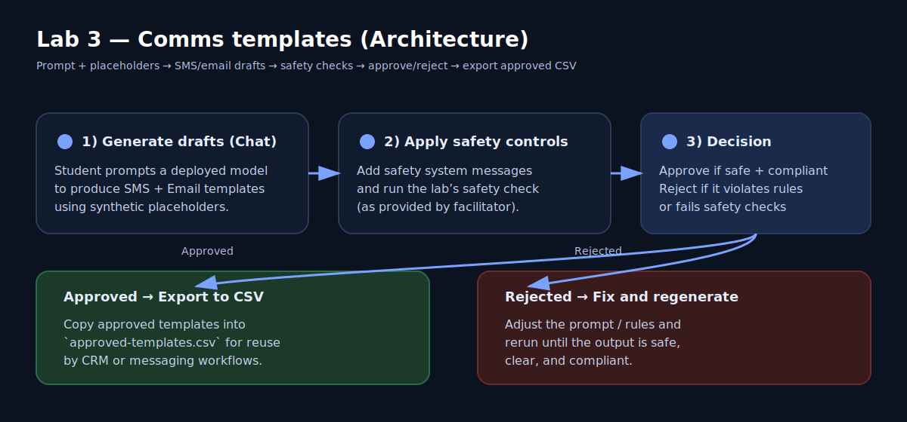

# Lab 3 — AI-driven SMS & Email templates (Microsoft Foundry + safety system messages)

## Learning objectives
- Generate parameterized SMS and Email templates for onboarding and repayment reminders
- Apply a content safety check and approve/reject templates
- Export approved templates to a CSV file for downstream channels

## Prereqs
- You have access to an Azure subscription provided for the training.
- Resource group: `skfinance`.
- Permissions: you have been added to the student group with the “Student Lab Contributor” role on the `skfinance` resource group.
- Facilitator-provided Microsoft Foundry details:
	- Foundry project link (URL): <FACILITATOR_PROVIDES>
	- Chat model deployment name: <FACILITATOR_PROVIDES>
- Facilitator has already prepared a content safety capability or policy check for the lab.

## Estimated time
35 minutes

## Architecture sketch


- You generate customer communications in Microsoft Foundry using a deployed model.
- You apply a content safety check and approve or reject each draft.
- You export approved drafts to CSV for reuse by a CRM or messaging system.

## Step-by-step
1. (Browser) Open Microsoft Foundry: https://ai.azure.com
2. (Microsoft Foundry) Select **Sign in** and sign in with the same account you use for the Azure portal.
3. (Microsoft Foundry) In the portal header, make sure the **New Foundry** toggle is **Off**.
4. (Microsoft Foundry) Open the project using the facilitator-provided **Foundry project link (URL)**.
5. (Microsoft Foundry) In the left pane, select **Playgrounds**.
6. (Microsoft Foundry) Select **Chat**.
7. (Microsoft Foundry) In **Deployment**, select the **Chat model deployment name** from the Prereqs section.
8. (Microsoft Foundry) In the **System message** box, paste the prompt below exactly.

### Prompt (copy/paste)
```
You are writing customer communications for SK Finance (an NBFC). Use only synthetic placeholders; do not invent personal data.

Create TWO outputs:
1) SMS template (max 320 characters)
2) Email template (subject + body)

Scenario:
- Message type: Repayment reminder
- Loan product: Two-wheeler loan
- Due date: <DUE_DATE>
- Amount due: <AMOUNT_DUE>
- Customer name: <CUSTOMER_NAME>
- Customer reference id: <CUSTOMER_REF>
- Tone: polite, clear, compliant

Rules:
- Do not include threats or coercive language.
- Include a clear call-to-action and a support number placeholder <SUPPORT_PHONE>.
- Do not include any real PII.

Return the result in this exact JSON format:
{
	"sms": "...",
	"email": {
		"subject": "...",
		"body": "..."
	}
}
```

9. (Microsoft Foundry) Select **Send**.
10. (Microsoft Foundry) Copy the model output into Notepad.

11. (Your notes) Replace placeholders with these synthetic values:
	- `<DUE_DATE>` = `15-Jan-2026`
	- `<AMOUNT_DUE>` = `INR 2,450`
	- `<CUSTOMER_NAME>` = `Asha Rao`
	- `<CUSTOMER_REF>` = `SKFIN-DEMO-000123`
	- `<SUPPORT_PHONE>` = `+91 90000 00000`

12. (Microsoft Foundry) Select **Add section**.
13. (Microsoft Foundry) Select **Safety system messages**.
14. (Microsoft Foundry) Select the safety system messages provided by the facilitator.
15. (Microsoft Foundry) Select **Apply changes**.
16. (Microsoft Foundry) When prompted to update the system message, select **Continue**.
17. (Microsoft Foundry) Run the lab’s content safety check exactly as instructed by the facilitator.

18. (Your notes) Mark the template as:
	- **Approved** if the content safety check is clean and the text follows the rules
	- **Rejected** if it fails the safety check or violates the rules

19. (Your notes) Create a CSV file named `approved-templates.csv` with this header row:

```
template_type,channel,subject_or_na,content
```

20. (Your notes) If your template is approved, add exactly two rows:
	- One row for `sms`
	- One row for `email`
21. (Your notes) Save the CSV file.

## Validation
- You generated JSON output containing:
	- one SMS template
	- one Email subject and body
- You completed a content safety check and recorded Approved/Rejected.
- If approved, your `approved-templates.csv` contains two rows and no real personal data.

## Cleanup
1. (Microsoft Foundry) In the chat playground, delete the chat content from the page (select all text and delete) so it is not left visible for the next user.
2. (Your notes) If you saved drafts locally, delete them when the facilitator confirms the lab is complete.

## Compliance / safety notes (RBI-aligned)
- Treat templates as customer-facing communications: require review, approval, logging, and change control.
- Do not place real customer data into prompts.
- Keep an audit trail of the final approved template text and who approved it.

## References
- https://learn.microsoft.com/en-us/azure/ai-foundry/quickstarts/get-started-playground?view=foundry-classic
- https://learn.microsoft.com/en-us/azure/ai-foundry/openai/concepts/safety-system-message-templates?view=foundry-classic
